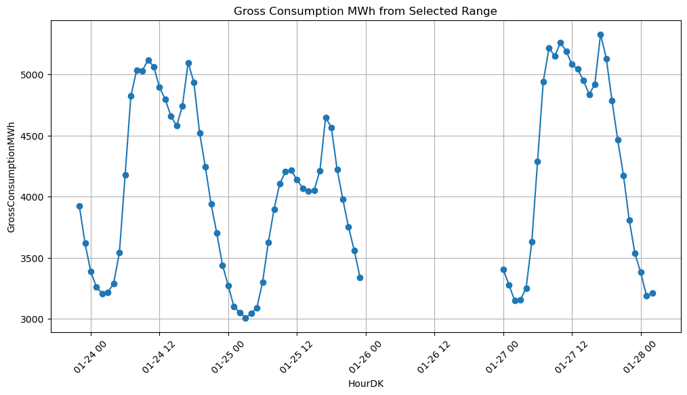

---
---
<div>
  <script type="text/x-mathjax-config">
    MathJax = {
      tex: {
        inlineMath: [['$','$'], ['\\(','\\)']],
        displayMath: [['$$','$$'], ['\\[','\\]']]
      }
    };
  </script>
  <script type="text/javascript" id="MathJax-script" async
    src="https://cdn.jsdelivr.net/npm/mathjax@3/es5/tex-mml-chtml.js">
  </script>
</div>


# Merge data to one datafile

## Libraries


```python
import pandas as pd
import numpy as np
import matplotlib.pyplot as plt
from scipy.interpolate import CubicSpline
import holidays

```

## Custom functions


```python
# Testing data frame
def check_dataframe(df):
    # Test 1: Check for missing values
    print("\nTest 1: Starting missing values check...")
    missing_values_count = df.isna().sum()
    print("Missing values count per column:\n", missing_values_count)

    if missing_values_count.sum() == 0:
        print("Passed: No missing values found.")
    else:
        print("Warning: Missing values detected.")

    # Test 2: Check for duplicate rows
    print("\nTest 2: Starting duplicate rows check...")
    duplicate_rows = df.duplicated() | df.duplicated(keep='last')
    count_duplicates = duplicate_rows.sum()
    print("Total duplicate rows (including first occurrences):", count_duplicates)

    if count_duplicates > 0:
        print("Duplicate rows detected. Here are some examples:")
        print(df[duplicate_rows].head(6))
    else:
        print("Passed: No duplicate rows found.")

    # Test 3: Check for missing observations between the specified date range
    print("\nTest 3: Checking for missing observations between '2020-01-01 01:00:00' & '2023-01-01 00:00:00'...")
    date_range = pd.date_range(start='2020-01-01 01:00:00', end='2022-12-31 00:00:00', freq='H', tz='UTC')
    df_dates = pd.to_datetime(df['HourDK'], utc=True)

    missing_dates = np.setdiff1d(date_range, df_dates)
    if len(missing_dates) == 0:
        print("Passed: No missing observations in the specified date range.")
    else:
        print("Warning: Missing observations detected in the specified date range. Here are some examples:")
        print(pd.to_datetime(missing_dates).to_series().head(6))

    # Test 4: Check for multiple observations with the same timestamp
    print("\nTest 4: Checking for multiple observations with the same timestamp...")
    duplicate_timestamps = df[df.duplicated('HourDK') | df.duplicated('HourDK', keep='last')]

    if duplicate_timestamps.empty:
        print("Passed: No multiple observations with the same timestamp found.")
    else:
        print("Warning: Multiple observations with the same timestamp found. Here are some examples:")
        print(duplicate_timestamps.sort_values('HourDK').head(6))
```


```python
# Function to plot data between selected start and end points
def plot_selected_range(df, start_idx, end_idx):
    selected_data = df.iloc[start_idx:end_idx+1]
    plt.figure(figsize=(12, 6))
    plt.plot(selected_data['HourDK'], selected_data['GrossConsumptionMWh'], marker='o')
    plt.xlabel('HourDK')
    plt.ylabel('GrossConsumptionMWh')
    plt.title('Gross Consumption MWh from Selected Range')
    plt.xticks(rotation=45)
    plt.grid(True)
    plt.show()
```

## Load data


```python
basepath = ""

df_consumption = pd.read_csv(f"{basepath}/Production and Consumption - Settlement.csv")
df_weather = pd.read_csv(f"{basepath}/vejr data.csv")
df_Ecar = pd.read_csv(f"{basepath}/ECar_data_hourly_combined.csv", encoding = "iso8859_10")
df_Hcar = pd.read_csv(f"{basepath}/Hybrid_Car_hourly_combined.csv", encoding = "iso8859_10")
df_price = pd.read_csv(f"{basepath}/EL_price_interpolated.csv")
```

## Cleaning the consumption data

### Choose relavant variables


```python
df_consumption = df_consumption[['HourDK', 'PriceArea', 'GrossConsumptionMWh']]
```

### Cut time period from 2020 to 2023


```python
df_consumption = df_consumption[(df_consumption['HourDK'] >= '2020-01-01 00:00:00') & (df_consumption['HourDK'] <= '2022-12-31 23:00:00')]
df_consumption = df_consumption.sort_values(by='HourDK')
```

### Sum up DK1 and DK2 (two price areas)


```python
df_consumption = df_consumption.groupby('HourDK', as_index=False)['GrossConsumptionMWh'].sum()
```

### filling out missning values


```python
date_range = pd.date_range(start='2020-01-01 00:00:00', end='2022-12-31 23:00:00', freq='H')
complete_dates = pd.DataFrame({'HourDK': date_range})
df_consumption['HourDK'] = pd.to_datetime(df_consumption['HourDK'])
df_consumption = pd.merge(complete_dates, df_consumption, on='HourDK', how='left')
```


```python
plot_selected_range(df_consumption, 550, 650)
```





```python
# Function to fill missing values considering hourly, daily, and weekly seasonality
def interpolate_seasonal(df):
    df['Hour'] = df['HourDK'].dt.hour
    df['DayOfWeek'] = df['HourDK'].dt.dayofweek
    df['Month'] = df['HourDK'].dt.month
    for hour in range(24):
        for day in range(7):
            for month in range(1, 13):
                condition = (df['Hour'] == hour) & (df['DayOfWeek'] == day) & (df['Month'] == month)
                seasonal_mean = df[condition]['GrossConsumptionMWh'].rolling(window=4, min_periods=1).mean()
                df.loc[condition & df['GrossConsumptionMWh'].isna(), 'GrossConsumptionMWh'] = seasonal_mean
    df.drop(columns=['Hour', 'DayOfWeek', 'Month'], inplace=True)
    return df

# Interpolate missing values
df_consumption = interpolate_seasonal(df_consumption)

plot_selected_range(df_consumption, 550, 650)
```


```python
check_dataframe(df_consumption)
```


    Test 1: Starting missing values check...
    Missing values count per column:
     HourDK                 0
    GrossConsumptionMWh    0
    dtype: int64
    Passed: No missing values found.

    Test 2: Starting duplicate rows check...
    Total duplicate rows (including first occurrences): 0
    Passed: No duplicate rows found.

    Test 3: Checking for missing observations between '2020-01-01 01:00:00' & '2023-01-01 00:00:00'...
    Passed: No missing observations in the specified date range.

    Test 4: Checking for multiple observations with the same timestamp...
    Passed: No multiple observations with the same timestamp found.


### Add day of week, time of day, month of year and Holiday variables


```python
df_consumption['HourDK'] = pd.to_datetime(df_consumption['HourDK'])

df_consumption['DayOfWeek'] = df_consumption['HourDK'].dt.day_name() # Add day of the week
df_consumption['Hour'] = df_consumption['HourDK'].dt.hour # Add time of the day (hour)
df_consumption['Month'] = df_consumption['HourDK'].dt.month_name() # Add month of the year

denmark_holidays = holidays.Denmark(years=range(df_consumption['HourDK'].dt.year.min(), df_consumption['HourDK'].dt.year.max() + 1))
df_consumption['IsHoliday'] = df_consumption['HourDK'].dt.date.isin(denmark_holidays).astype(int) # Add holiday column

df_consumption

```


<div>
<style scoped>
    .dataframe tbody tr th:only-of-type {
        vertical-align: middle;
    }

    .dataframe tbody tr th {
        vertical-align: top;
    }

    .dataframe thead th {
        text-align: right;
    }
</style>
<table border="1" class="dataframe">
  <thead>
    <tr style="text-align: right;">
      <th></th>
      <th>HourDK</th>
      <th>GrossConsumptionMWh</th>
      <th>DayOfWeek</th>
      <th>Hour</th>
      <th>Month</th>
      <th>IsHoliday</th>
    </tr>
  </thead>
  <tbody>
    <tr>
      <th>0</th>
      <td>2020-01-01 00:00:00</td>
      <td>3331.347290</td>
      <td>Wednesday</td>
      <td>0</td>
      <td>January</td>
      <td>1</td>
    </tr>
    <tr>
      <th>1</th>
      <td>2020-01-01 01:00:00</td>
      <td>3257.505005</td>
      <td>Wednesday</td>
      <td>1</td>
      <td>January</td>
      <td>1</td>
    </tr>
    <tr>
      <th>2</th>
      <td>2020-01-01 02:00:00</td>
      <td>3161.865601</td>
      <td>Wednesday</td>
      <td>2</td>
      <td>January</td>
      <td>1</td>
    </tr>
    <tr>
      <th>3</th>
      <td>2020-01-01 03:00:00</td>
      <td>3074.752442</td>
      <td>Wednesday</td>
      <td>3</td>
      <td>January</td>
      <td>1</td>
    </tr>
    <tr>
      <th>4</th>
      <td>2020-01-01 04:00:00</td>
      <td>3009.696167</td>
      <td>Wednesday</td>
      <td>4</td>
      <td>January</td>
      <td>1</td>
    </tr>
    <tr>
      <th>...</th>
      <td>...</td>
      <td>...</td>
      <td>...</td>
      <td>...</td>
      <td>...</td>
      <td>...</td>
    </tr>
    <tr>
      <th>26299</th>
      <td>2022-12-31 19:00:00</td>
      <td>4453.297648</td>
      <td>Saturday</td>
      <td>19</td>
      <td>December</td>
      <td>0</td>
    </tr>
    <tr>
      <th>26300</th>
      <td>2022-12-31 20:00:00</td>
      <td>4245.987671</td>
      <td>Saturday</td>
      <td>20</td>
      <td>December</td>
      <td>0</td>
    </tr>
    <tr>
      <th>26301</th>
      <td>2022-12-31 21:00:00</td>
      <td>4092.871013</td>
      <td>Saturday</td>
      <td>21</td>
      <td>December</td>
      <td>0</td>
    </tr>
    <tr>
      <th>26302</th>
      <td>2022-12-31 22:00:00</td>
      <td>3918.759766</td>
      <td>Saturday</td>
      <td>22</td>
      <td>December</td>
      <td>0</td>
    </tr>
    <tr>
      <th>26303</th>
      <td>2022-12-31 23:00:00</td>
      <td>3821.722046</td>
      <td>Saturday</td>
      <td>23</td>
      <td>December</td>
      <td>0</td>
    </tr>
  </tbody>
</table>
<p>26304 rows × 6 columns</p>
</div>


## Weather data


```python
df_weather
```


<div>
<style scoped>
    .dataframe tbody tr th:only-of-type {
        vertical-align: middle;
    }

    .dataframe tbody tr th {
        vertical-align: top;
    }

    .dataframe thead th {
        text-align: right;
    }
</style>
<table border="1" class="dataframe">
  <thead>
    <tr style="text-align: right;">
      <th></th>
      <th>Unnamed: 0</th>
      <th>properties.observed</th>
      <th>humidity_past1h</th>
      <th>leav_hum_dur_past1h</th>
      <th>precip_dur_past1h</th>
      <th>precip_past1h</th>
      <th>radia_glob_past1h</th>
      <th>sun_last1h_glob</th>
      <th>temp_grass_max_past1h</th>
      <th>temp_grass_mean_past1h</th>
      <th>...</th>
      <th>temp_mean_past1h</th>
      <th>temp_min_past1h</th>
      <th>temp_soil_max_past1h</th>
      <th>temp_soil_mean_past1h</th>
      <th>temp_soil_min_past1h</th>
      <th>wind_dir_past1h</th>
      <th>wind_gust_always_past1h</th>
      <th>wind_max_per10min_past1h</th>
      <th>wind_min_past1h</th>
      <th>wind_speed_past1h</th>
    </tr>
  </thead>
  <tbody>
    <tr>
      <th>0</th>
      <td>2</td>
      <td>2005-01-01T00:00:00Z</td>
      <td>95.111111</td>
      <td>34.133333</td>
      <td>0.000000</td>
      <td>0.011429</td>
      <td>0.043478</td>
      <td>0.000000</td>
      <td>0.733333</td>
      <td>0.361905</td>
      <td>...</td>
      <td>2.125926</td>
      <td>1.844444</td>
      <td>3.106667</td>
      <td>3.040000</td>
      <td>3.006667</td>
      <td>268.440000</td>
      <td>5.372000</td>
      <td>4.290698</td>
      <td>1.588889</td>
      <td>3.434000</td>
    </tr>
    <tr>
      <th>1</th>
      <td>3</td>
      <td>2005-01-01T01:00:00Z</td>
      <td>94.672727</td>
      <td>31.466667</td>
      <td>0.000000</td>
      <td>0.000000</td>
      <td>0.043478</td>
      <td>0.000000</td>
      <td>0.318182</td>
      <td>-0.009091</td>
      <td>...</td>
      <td>1.836364</td>
      <td>1.567273</td>
      <td>3.013333</td>
      <td>2.960000</td>
      <td>2.900000</td>
      <td>259.901961</td>
      <td>5.419608</td>
      <td>4.254545</td>
      <td>0.800000</td>
      <td>3.449020</td>
    </tr>
    <tr>
      <th>2</th>
      <td>4</td>
      <td>2005-01-01T02:00:00Z</td>
      <td>94.545455</td>
      <td>30.666667</td>
      <td>0.000000</td>
      <td>0.000000</td>
      <td>0.043478</td>
      <td>0.000000</td>
      <td>0.213636</td>
      <td>-0.159091</td>
      <td>...</td>
      <td>1.723636</td>
      <td>1.420000</td>
      <td>2.906667</td>
      <td>2.860000</td>
      <td>2.793333</td>
      <td>256.098039</td>
      <td>5.490196</td>
      <td>4.360465</td>
      <td>0.780000</td>
      <td>3.507843</td>
    </tr>
    <tr>
      <th>3</th>
      <td>5</td>
      <td>2005-01-01T03:00:00Z</td>
      <td>94.537037</td>
      <td>31.133333</td>
      <td>0.000000</td>
      <td>0.000000</td>
      <td>0.043478</td>
      <td>0.000000</td>
      <td>0.314286</td>
      <td>-0.061905</td>
      <td>...</td>
      <td>1.796296</td>
      <td>1.546296</td>
      <td>2.806667</td>
      <td>2.773333</td>
      <td>2.720000</td>
      <td>257.500000</td>
      <td>5.956000</td>
      <td>4.562791</td>
      <td>0.950000</td>
      <td>3.754000</td>
    </tr>
    <tr>
      <th>4</th>
      <td>6</td>
      <td>2005-01-01T04:00:00Z</td>
      <td>94.909091</td>
      <td>31.800000</td>
      <td>0.000000</td>
      <td>0.000000</td>
      <td>0.043478</td>
      <td>0.000000</td>
      <td>0.127273</td>
      <td>-0.313636</td>
      <td>...</td>
      <td>1.669091</td>
      <td>1.374545</td>
      <td>2.733333</td>
      <td>2.680000</td>
      <td>2.653333</td>
      <td>248.019608</td>
      <td>5.817647</td>
      <td>4.704651</td>
      <td>0.000000</td>
      <td>3.786275</td>
    </tr>
    <tr>
      <th>...</th>
      <td>...</td>
      <td>...</td>
      <td>...</td>
      <td>...</td>
      <td>...</td>
      <td>...</td>
      <td>...</td>
      <td>...</td>
      <td>...</td>
      <td>...</td>
      <td>...</td>
      <td>...</td>
      <td>...</td>
      <td>...</td>
      <td>...</td>
      <td>...</td>
      <td>...</td>
      <td>...</td>
      <td>...</td>
      <td>...</td>
      <td>...</td>
    </tr>
    <tr>
      <th>162090</th>
      <td>162092</td>
      <td>2023-07-02T18:00:00Z</td>
      <td>70.900000</td>
      <td>11.875000</td>
      <td>0.287356</td>
      <td>0.132115</td>
      <td>206.607143</td>
      <td>25.608696</td>
      <td>16.225000</td>
      <td>15.106250</td>
      <td>...</td>
      <td>14.977586</td>
      <td>14.008621</td>
      <td>17.273333</td>
      <td>17.293750</td>
      <td>17.046667</td>
      <td>243.875000</td>
      <td>16.509804</td>
      <td>11.530233</td>
      <td>5.364286</td>
      <td>10.100000</td>
    </tr>
    <tr>
      <th>162091</th>
      <td>162093</td>
      <td>2023-07-02T19:00:00Z</td>
      <td>73.000000</td>
      <td>14.812500</td>
      <td>0.313953</td>
      <td>0.119712</td>
      <td>139.285714</td>
      <td>25.065217</td>
      <td>14.968750</td>
      <td>14.300000</td>
      <td>...</td>
      <td>14.462069</td>
      <td>13.893103</td>
      <td>17.180000</td>
      <td>17.156250</td>
      <td>16.833333</td>
      <td>243.642857</td>
      <td>15.868627</td>
      <td>11.006977</td>
      <td>5.288095</td>
      <td>9.578571</td>
    </tr>
    <tr>
      <th>162092</th>
      <td>162094</td>
      <td>2023-07-02T20:00:00Z</td>
      <td>75.050000</td>
      <td>10.625000</td>
      <td>0.325581</td>
      <td>0.159615</td>
      <td>72.535714</td>
      <td>7.217391</td>
      <td>14.100000</td>
      <td>13.731250</td>
      <td>...</td>
      <td>13.984483</td>
      <td>13.343103</td>
      <td>17.046667</td>
      <td>16.987500</td>
      <td>16.640000</td>
      <td>239.910714</td>
      <td>15.121569</td>
      <td>10.604651</td>
      <td>5.071795</td>
      <td>9.241071</td>
    </tr>
    <tr>
      <th>162093</th>
      <td>162095</td>
      <td>2023-07-02T21:00:00Z</td>
      <td>75.813559</td>
      <td>8.875000</td>
      <td>0.119048</td>
      <td>0.085146</td>
      <td>47.928571</td>
      <td>0.000000</td>
      <td>13.712500</td>
      <td>13.318750</td>
      <td>...</td>
      <td>13.703509</td>
      <td>13.198246</td>
      <td>16.880000</td>
      <td>16.818750</td>
      <td>16.546667</td>
      <td>237.750000</td>
      <td>14.862745</td>
      <td>10.337209</td>
      <td>5.396970</td>
      <td>9.019643</td>
    </tr>
    <tr>
      <th>162094</th>
      <td>162096</td>
      <td>2023-07-02T22:00:00Z</td>
      <td>75.714286</td>
      <td>20.000000</td>
      <td>0.600000</td>
      <td>0.053333</td>
      <td>36.727273</td>
      <td>0.000000</td>
      <td>14.000000</td>
      <td>13.620000</td>
      <td>...</td>
      <td>13.685714</td>
      <td>13.175000</td>
      <td>16.500000</td>
      <td>16.333333</td>
      <td>16.100000</td>
      <td>241.777778</td>
      <td>14.640741</td>
      <td>11.189474</td>
      <td>4.615789</td>
      <td>9.048148</td>
    </tr>
  </tbody>
</table>
<p>162095 rows × 22 columns</p>
</div>


### Choose relavant variables


```python
df_weather = df_weather[['properties.observed','humidity_past1h', 'temp_mean_past1h', 'wind_speed_past1h']]
```

### Cut time period from 2020 to 2023


```python
# Convert properties.observed to datetime and rename to HourDK
df_weather['properties.observed'] = pd.to_datetime(df_weather['properties.observed']).dt.tz_convert(None)
df_weather.rename(columns={"properties.observed": "HourDK"}, inplace=True)
df_weather
```

<div>
<style scoped>
    .dataframe tbody tr th:only-of-type {
        vertical-align: middle;
    }

    .dataframe tbody tr th {
        vertical-align: top;
    }

    .dataframe thead th {
        text-align: right;
    }
</style>
<table border="1" class="dataframe">
  <thead>
    <tr style="text-align: right;">
      <th></th>
      <th>HourDK</th>
      <th>humidity_past1h</th>
      <th>temp_mean_past1h</th>
      <th>wind_speed_past1h</th>
    </tr>
  </thead>
  <tbody>
    <tr>
      <th>0</th>
      <td>2005-01-01 00:00:00</td>
      <td>95.111111</td>
      <td>2.125926</td>
      <td>3.434000</td>
    </tr>
    <tr>
      <th>1</th>
      <td>2005-01-01 01:00:00</td>
      <td>94.672727</td>
      <td>1.836364</td>
      <td>3.449020</td>
    </tr>
    <tr>
      <th>2</th>
      <td>2005-01-01 02:00:00</td>
      <td>94.545455</td>
      <td>1.723636</td>
      <td>3.507843</td>
    </tr>
    <tr>
      <th>3</th>
      <td>2005-01-01 03:00:00</td>
      <td>94.537037</td>
      <td>1.796296</td>
      <td>3.754000</td>
    </tr>
    <tr>
      <th>4</th>
      <td>2005-01-01 04:00:00</td>
      <td>94.909091</td>
      <td>1.669091</td>
      <td>3.786275</td>
    </tr>
    <tr>
      <th>...</th>
      <td>...</td>
      <td>...</td>
      <td>...</td>
      <td>...</td>
    </tr>
    <tr>
      <th>162090</th>
      <td>2023-07-02 18:00:00</td>
      <td>70.900000</td>
      <td>14.977586</td>
      <td>10.100000</td>
    </tr>
    <tr>
      <th>162091</th>
      <td>2023-07-02 19:00:00</td>
      <td>73.000000</td>
      <td>14.462069</td>
      <td>9.578571</td>
    </tr>
    <tr>
      <th>162092</th>
      <td>2023-07-02 20:00:00</td>
      <td>75.050000</td>
      <td>13.984483</td>
      <td>9.241071</td>
    </tr>
    <tr>
      <th>162093</th>
      <td>2023-07-02 21:00:00</td>
      <td>75.813559</td>
      <td>13.703509</td>
      <td>9.019643</td>
    </tr>
    <tr>
      <th>162094</th>
      <td>2023-07-02 22:00:00</td>
      <td>75.714286</td>
      <td>13.685714</td>
      <td>9.048148</td>
    </tr>
  </tbody>
</table>
<p>162095 rows × 4 columns</p>
</div>


```python
df_weather = df_weather[(df_weather['HourDK'] >= '2020-01-01 00:00:00') & (df_weather['HourDK'] <= '2022-12-31 23:00:00')]
df_weather = df_weather.sort_values(by='HourDK')
```

### Filling out missing values


```python
complete_dates = pd.DataFrame({'HourDK': date_range})
df_weather['HourDK'] = pd.to_datetime(df_weather['HourDK'])
df_weather = pd.merge(complete_dates, df_weather, on='HourDK', how='left')
```


```python
# Function to interpolate missing values using cubic splines
def cubic_spline_interpolation(df, column_name):
    not_nan = df.loc[~df[column_name].isna(), ['HourDK', column_name]]
    cs = CubicSpline(not_nan['HourDK'].astype(np.int64) / 1e9, not_nan[column_name])
    nan_idx = df.loc[df[column_name].isna(), 'HourDK']
    df.loc[df[column_name].isna(), column_name] = cs(nan_idx.astype(np.int64) / 1e9)
    return df
```


```python
# Apply cubic spline interpolation for each column with missing values
for col in ['humidity_past1h', 'temp_mean_past1h', 'wind_speed_past1h']:
    df_weather = cubic_spline_interpolation(df_weather, col)
```


```python
selected_data = df_weather.iloc[350:400+1]
plt.figure(figsize=(12, 6))
plt.plot(selected_data['HourDK'], selected_data['temp_mean_past1h'], marker='o')
plt.xlabel('HourDK')
plt.ylabel('temp_mean_past1h')
plt.title('temp_mean_past1h from Selected Range')
plt.xticks(rotation=45)
plt.grid(True)
plt.show()
```


```python
check_dataframe(df_weather)
```


    Test 1: Starting missing values check...
    Missing values count per column:
     HourDK               0
    humidity_past1h      0
    temp_mean_past1h     0
    wind_speed_past1h    0
    dtype: int64
    Passed: No missing values found.

    Test 2: Starting duplicate rows check...
    Total duplicate rows (including first occurrences): 0
    Passed: No duplicate rows found.

    Test 3: Checking for missing observations between '2020-01-01 01:00:00' & '2023-01-01 00:00:00'...
    Passed: No missing observations in the specified date range.

    Test 4: Checking for multiple observations with the same timestamp...
    Passed: No multiple observations with the same timestamp found.


## Car data


```python
df_Ecar = pd.read_csv(f"{basepath}/ECar_data_hourly_combined.csv", encoding = "iso8859_10")
df_Hcar = pd.read_csv(f"{basepath}/Hybrid_Car_hourly_combined.csv", encoding = "iso8859_10")
```

### Choose relavant variables


```python
df_Ecar = df_Ecar[['Unnamed: 0','Region Hovedstaden', 'Region Sjælland', 'Region Syddanmark','Region Midtjylland','Region Nordjylland']]
df_Hcar = df_Hcar[['Unnamed: 0','Region Hovedstaden', 'Region Sjælland', 'Region Syddanmark','Region Midtjylland','Region Nordjylland']]

df_Ecar.rename(columns={'Unnamed: 0': 'HourDK'}, inplace=True)
df_Hcar.rename(columns={'Unnamed: 0': 'HourDK'}, inplace=True)
```

### Sum all regions to one variable for all of DK


```python
df_Ecar['Electric cars'] = df_Ecar.loc[:, df_Ecar.columns != 'HourDK'].sum(axis=1)
df_Hcar['Plug-in hybrid cars'] = df_Hcar.loc[:, df_Hcar.columns != 'HourDK'].sum(axis=1)

df_Ecar = df_Ecar[['HourDK','Electric cars']]
df_Hcar = df_Hcar[['HourDK','Plug-in hybrid cars']]
```

### Percentage change


```python

df_Ecar['HourDK'] = pd.to_datetime(df_Ecar['HourDK']) # Ensure 'Unnamed: 0' is treated as datetime
df_Hcar['HourDK'] = pd.to_datetime(df_Ecar['HourDK'])

df_Ecar['Electric cars'] = df_Ecar['Electric cars'].pct_change() * 100 # Calculate the percentage change
df_Hcar['Plug-in hybrid cars'] = df_Hcar['Plug-in hybrid cars'].pct_change() * 100
```

### Cut time period


```python
df_Ecar = df_Ecar[(df_Ecar['HourDK'] >= '2020-01-01 00:00:00') & (df_Ecar['HourDK'] <= '2022-12-31 23:00:00')]
df_Ecar = df_Ecar.sort_values(by='HourDK')

df_Hcar = df_Hcar[(df_Hcar['HourDK'] >= '2020-01-01 00:00:00') & (df_Hcar['HourDK'] <= '2022-12-31 23:00:00')]
df_Hcar = df_Hcar.sort_values(by='HourDK')
```


```python
check_dataframe(df_Ecar)
check_dataframe(df_Hcar)
```


    Test 1: Starting missing values check...
    Missing values count per column:
     HourDK           0
    Electric cars    0
    dtype: int64
    Passed: No missing values found.

    Test 2: Starting duplicate rows check...
    Total duplicate rows (including first occurrences): 0
    Passed: No duplicate rows found.

    Test 3: Checking for missing observations between '2020-01-01 01:00:00' & '2023-01-01 00:00:00'...
    Passed: No missing observations in the specified date range.

    Test 4: Checking for multiple observations with the same timestamp...
    Passed: No multiple observations with the same timestamp found.

    Test 1: Starting missing values check...
    Missing values count per column:
     HourDK                 0
    Plug-in hybrid cars    0
    dtype: int64
    Passed: No missing values found.

    Test 2: Starting duplicate rows check...
    Total duplicate rows (including first occurrences): 0
    Passed: No duplicate rows found.

    Test 3: Checking for missing observations between '2020-01-01 01:00:00' & '2023-01-01 00:00:00'...
    Passed: No missing observations in the specified date range.

    Test 4: Checking for multiple observations with the same timestamp...
    Passed: No multiple observations with the same timestamp found.


## Price data


```python
df_price = pd.read_csv(f"{basepath}/EL_price_interpolated.csv")
```

### Take mean of DK1 and DK2 prices, cut to time period and delete duplicates


```python
df_price['EL_price'] = df_price.loc[:, df_price.columns != 'DateTime'].mean(axis=1)
df_price = df_price[['DateTime','EL_price']]

df_price.rename(columns={'DateTime': 'HourDK'}, inplace=True)

df_price = df_price[(df_price['HourDK'] >= '2020-01-01 00:00:00') & (df_price['HourDK'] <= '2022-12-31 23:00:00')]
df_price = df_price.sort_values(by='HourDK')
df_price = df_price.drop_duplicates()
```


```python
check_dataframe(df_price)
```


    Test 1: Starting missing values check...
    Missing values count per column:
     HourDK      0
    EL_price    0
    dtype: int64
    Passed: No missing values found.

    Test 2: Starting duplicate rows check...
    Total duplicate rows (including first occurrences): 0
    Passed: No duplicate rows found.

    Test 3: Checking for missing observations between '2020-01-01 01:00:00' & '2023-01-01 00:00:00'...
    Passed: No missing observations in the specified date range.

    Test 4: Checking for multiple observations with the same timestamp...
    Passed: No multiple observations with the same timestamp found.


## Merge


```python
df_consumption['HourDK'] = pd.to_datetime(df_consumption['HourDK'])
df_weather['HourDK'] = pd.to_datetime(df_weather['HourDK'])
df_Ecar['HourDK'] = pd.to_datetime(df_Ecar['HourDK'])
df_Hcar['HourDK'] = pd.to_datetime(df_Hcar['HourDK'])
df_price['HourDK'] = pd.to_datetime(df_price['HourDK'])

# Merge dataframes one by one on the 'HourDK' column
df_merged = df_consumption
df_merged = pd.merge(df_merged, df_weather, on='HourDK', how='outer')
df_merged = pd.merge(df_merged, df_Ecar, on='HourDK', how='outer')
df_merged = pd.merge(df_merged, df_Hcar, on='HourDK', how='outer')
df_merged = pd.merge(df_merged, df_price, on='HourDK', how='outer')
df_merged
```


<div>
<style scoped>
    .dataframe tbody tr th:only-of-type {
        vertical-align: middle;
    }

    .dataframe tbody tr th {
        vertical-align: top;
    }

    .dataframe thead th {
        text-align: right;
    }
</style>
<table border="1" class="dataframe">
  <thead>
    <tr style="text-align: right;">
      <th></th>
      <th>HourDK</th>
      <th>GrossConsumptionMWh</th>
      <th>DayOfWeek</th>
      <th>Hour</th>
      <th>Month</th>
      <th>IsHoliday</th>
      <th>humidity_past1h</th>
      <th>temp_mean_past1h</th>
      <th>wind_speed_past1h</th>
      <th>Electric cars</th>
      <th>Plug-in hybrid cars</th>
      <th>EL_price</th>
    </tr>
  </thead>
  <tbody>
    <tr>
      <th>0</th>
      <td>2020-01-01 00:00:00</td>
      <td>3331.347290</td>
      <td>Wednesday</td>
      <td>0</td>
      <td>January</td>
      <td>1</td>
      <td>83.916667</td>
      <td>0.187500</td>
      <td>4.916667</td>
      <td>0.016835</td>
      <td>0.038498</td>
      <td>0.249650</td>
    </tr>
    <tr>
      <th>1</th>
      <td>2020-01-01 01:00:00</td>
      <td>3257.505005</td>
      <td>Wednesday</td>
      <td>1</td>
      <td>January</td>
      <td>1</td>
      <td>84.459016</td>
      <td>2.295000</td>
      <td>5.098246</td>
      <td>-0.011556</td>
      <td>-0.020534</td>
      <td>0.237330</td>
    </tr>
    <tr>
      <th>2</th>
      <td>2020-01-01 02:00:00</td>
      <td>3161.865601</td>
      <td>Wednesday</td>
      <td>2</td>
      <td>January</td>
      <td>1</td>
      <td>84.016393</td>
      <td>2.451667</td>
      <td>5.159649</td>
      <td>0.002639</td>
      <td>0.008969</td>
      <td>0.235830</td>
    </tr>
    <tr>
      <th>3</th>
      <td>2020-01-01 03:00:00</td>
      <td>3074.752442</td>
      <td>Wednesday</td>
      <td>3</td>
      <td>January</td>
      <td>1</td>
      <td>82.885246</td>
      <td>2.671667</td>
      <td>5.585965</td>
      <td>0.002639</td>
      <td>0.008963</td>
      <td>0.233660</td>
    </tr>
    <tr>
      <th>4</th>
      <td>2020-01-01 04:00:00</td>
      <td>3009.696167</td>
      <td>Wednesday</td>
      <td>4</td>
      <td>January</td>
      <td>1</td>
      <td>81.754098</td>
      <td>2.873333</td>
      <td>5.877193</td>
      <td>0.002640</td>
      <td>0.008957</td>
      <td>0.230450</td>
    </tr>
    <tr>
      <th>...</th>
      <td>...</td>
      <td>...</td>
      <td>...</td>
      <td>...</td>
      <td>...</td>
      <td>...</td>
      <td>...</td>
      <td>...</td>
      <td>...</td>
      <td>...</td>
      <td>...</td>
      <td>...</td>
    </tr>
    <tr>
      <th>26299</th>
      <td>2022-12-31 19:00:00</td>
      <td>4453.297648</td>
      <td>Saturday</td>
      <td>19</td>
      <td>December</td>
      <td>0</td>
      <td>93.116667</td>
      <td>4.655000</td>
      <td>4.362500</td>
      <td>0.002892</td>
      <td>0.001197</td>
      <td>0.305240</td>
    </tr>
    <tr>
      <th>26300</th>
      <td>2022-12-31 20:00:00</td>
      <td>4245.987671</td>
      <td>Saturday</td>
      <td>20</td>
      <td>December</td>
      <td>0</td>
      <td>93.650000</td>
      <td>4.488333</td>
      <td>4.130357</td>
      <td>0.002893</td>
      <td>0.001197</td>
      <td>0.193615</td>
    </tr>
    <tr>
      <th>26301</th>
      <td>2022-12-31 21:00:00</td>
      <td>4092.871013</td>
      <td>Saturday</td>
      <td>21</td>
      <td>December</td>
      <td>0</td>
      <td>93.850000</td>
      <td>4.443333</td>
      <td>3.760714</td>
      <td>0.002893</td>
      <td>0.001198</td>
      <td>0.110730</td>
    </tr>
    <tr>
      <th>26302</th>
      <td>2022-12-31 22:00:00</td>
      <td>3918.759766</td>
      <td>Saturday</td>
      <td>22</td>
      <td>December</td>
      <td>0</td>
      <td>94.200000</td>
      <td>4.376667</td>
      <td>3.714286</td>
      <td>0.002894</td>
      <td>0.001199</td>
      <td>0.073920</td>
    </tr>
    <tr>
      <th>26303</th>
      <td>2022-12-31 23:00:00</td>
      <td>3821.722046</td>
      <td>Saturday</td>
      <td>23</td>
      <td>December</td>
      <td>0</td>
      <td>94.316667</td>
      <td>4.465000</td>
      <td>4.164286</td>
      <td>0.002895</td>
      <td>0.001200</td>
      <td>0.035990</td>
    </tr>
  </tbody>
</table>
<p>26304 rows × 12 columns</p>
</div>


```python
# Assuming df_merged is your DataFrame
# Replace 'output_file.csv' with your desired file path and name
df_merged.to_csv('output_file.csv', index=False)
```
