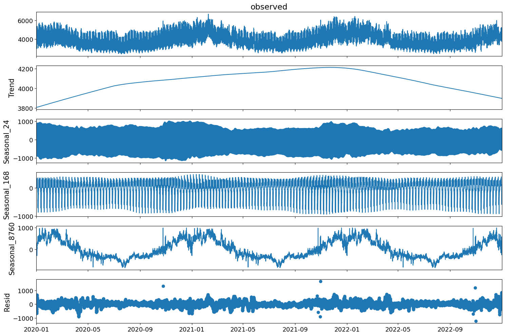

## 4.7 Decomposing energy consumption patterns

Following the exploration of multiple seasonality within energy consumption, it becomes essential to decompose the observed patterns to recognize underlying trends and the cyclical behavior. Time series decomposition allow us to separate data into components of trend, seasonal and remainders, each providing unique insights into the nature of energy consumption fluctuations. Therefor this chapter will utilize MSTL approach to help break down these components within our dataset.

### 4.7.1 MSTL decomposition analysis

We will start by looking at the observed Energy consumption afterwards we will be analyzing the trend, seasonal and remaining components:


```python
import pandas as pd
import matplotlib.pyplot as plt
from statsmodels.tsa.seasonal import MSTL

mstl = MSTL(
    Energy_Data['GrossConsumptionMWh'],
    periods=[24, 24*7, 24 * 365],  # Adjusted to daily and weekly periods
    #windows=[101, 101, 101],  # Large windows for a smoother seasonal component
    iterate=10,
    stl_kwargs={
        "trend": 24 * 365+1,  # Adjusted to be larger than the longest period (24*7) and an odd number
        "seasonal_deg": 0,  # Fit with a moving average
    }
)

res = mstl.fit()
```


```python
# Assuming 'Energy_Data' DataFrame is already defined and it has 'sum_quantity'
plt.rcParams['figure.figsize'] = (15, 10)  # Set the size of the figure

# Adjusting text sizes globally using rcParams
plt.rcParams.update({
    'axes.titlesize': 17,   # Title size 16
    'axes.labelsize': 15,   # Axis label size 14
    'xtick.labelsize': 13,  # X-axis tick label size 12
    'ytick.labelsize': 13,  # Y-axis tick label size 12
    'legend.fontsize': 13   # Legend font size 12
})

ax = res.plot()

# If additional local adjustments are needed, for instance:
#ax.set_title('Multiple Seasonal Decomposition', fontsize=20)
#ax.set_xlabel('Time', fontsize=16)
#ax.set_ylabel('sum_quantity', fontsize=16)

plt.show()
```





We can observe in figure above that the energy consumption, captured over several years, presents a visual confirmation of the fluctuations previously discussed. The time series exhibits a recurring pattern with visible

peaks and troughs that suggest the influence of both external factors, such as weather conditions, and inherent consumer behaviors.

If we now look at the trend component extracted from the MSTL decomposition reveals a long-term movement in the data. This trend of a concave slope that peaks in the start of 2022 which might be indicative of various factors, including advancements in energy efficiency, changes in consumer habits, a fall in the consumer base to name some reasons. The seasonal components reflect what has been discussed earlier, therefor to summarize it reflects different cycles and each season captures variations at different timescales. It also as mentioned before displays prominent repeated peaks corresponding to specific times when energy consumption is consistently higher.

The remainders of the decomposition represent the noise or irregularities not explained by the trend or seasonal components. Fluctuations in the residuals could stem from unpredictable events, outliers, data anomalies, or other non-systematic factors affecting energy consumption.

The MSTL decomposition provides a detailed dissection of the energy consumption time series. The identification of a declining trend could have a significant impact for long-term energy planning. Similarly, recognizing the specific seasonal patterns aids in developing the accuracy of short-term forecasting models. The remaining component's analysis could also lead to improved models by identifying and accounting for anomalies.


```python

```
