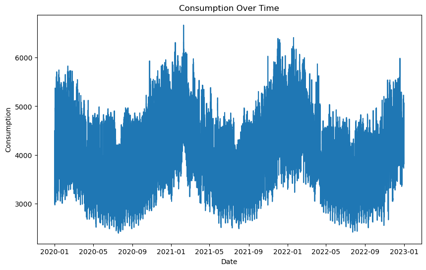

---
---
```python
from IPython.display import display, HTML

import pandas as pd
import numpy as np

import matplotlib.pyplot as plt
import seaborn as sns
```

## 4.5 Multiple seasonality in energy consumption

Energy Consumption patterns often exhibit seasonality, which reflects periodic fluctuations that recur over specific time intervals. The energy consumption is expected to have yearly, monthly, weekly, and daily seasonality, analyzing these seasonality components can help in the understanding of energy forecasting and help to identify cyclical variations. This section will explore the concept of multiple seasonality within the dataset, revealing patterns on different timespans and help decompose seasonality and trends if there are any.

### 4.5.1 Yearly, monthly, weekly and daily seasonality
The first graph called “Consumption Over Time”, depicts energy consumption trends over a span of more than three years (2020-2023). The consumption over the period 2020-2023 has been illustrated to show if there is any yearly seasonality:


```python
df = pd.read_csv("path", encoding="utf-8")
```


```python
# Reset index
df.reset_index(inplace=True)

# Select only the necessary columns
Energy_Data = df[['HourDK', 'GrossConsumptionMWh']]
# Convert 'HourDK' to datetime format and set it as index
Energy_Data['HourDK'] = pd.to_datetime(Energy_Data['HourDK'])
```


```python
# Plotting
plt.figure(figsize=(10,6))
plt.plot(Energy_Data['HourDK'], Energy_Data['GrossConsumptionMWh'])
plt.title('Consumption Over Time')
plt.xlabel('Date')
plt.ylabel('Consumption')
plt.show()
Energy_Data.set_index('HourDK', inplace=True)
```





The visualized data of consumption demonstrate a clear seasonal pattern with the consumption peaking during certain periods which is very likely correlating with seasonal temperature changes. The peaks in consumption likely indicate winter months, where the consumers probably use some heat, whereas this could correspond to warmer months with lower heating requirements. It is observable that this pattern repeats annually, which is consistent with the characteristic of seasonal behavior which is influenced by weather conditions. In the winter months, it becomes darker outside at an early hour and therefore it might be expected for the consumers to use more light which uses electricity. Another profound observation is that the overall consumption is decreasing. This might not be expected due to the increase in electrical vehicles and other systems that require more energy. When observing the seasonality distribution monthly, the following is observed:


```python
 # Assuming 'Energy_Data' DataFrame is already defined
fig, ax = plt.subplots(figsize=(15, 6))
Energy_Data['month'] = Energy_Data.index.month
Energy_Data.boxplot(column='GrossConsumptionMWh', by='month', ax=ax)
# Plot median values
Energy_Data.groupby('month')['GrossConsumptionMWh'].median().plot(style='o-', linewidth=0.8, ax=ax, fontsize=16)

ax.set_ylabel('Energy Consumption', fontsize=16)
ax.set_xlabel('Month', fontsize=16)
ax.set_title('Energy Consumption Distribution Across Different Months', fontsize=16)
fig.suptitle('')

# Set custom x-axis labels with month names
month_names = ['Jan', 'Feb', 'Mar', 'Apr', 'May', 'Jun', 'Jul', 'Aug', 'Sep', 'Oct', 'Nov', 'Dec']
ax.set_xticklabels(month_names)

plt.show()
```


The plot above illustrates a clear seasonal trend with a distinct pattern, the consumption dips during the warmer months and rises as the weather cools. When the temperature rises the consumption falls as observed before. The presence of outliners is observed which are particularly around in the colder months it could be speculated that these outliners are the product of extreme weather conditions or other non-regular factors that could affect consumption. These outliners are only in the top percentiles and they are the hardest to predict but also the most valuable to predict.

The interquartile range (IQR) depicted by the box size varies across different months, indicating that the dispersion of consumption values is not uniform throughout the year. For instance, the IQR is broader during high-consumption months, potentially signaling greater variability in energy usage during colder periods, which could be influenced by varying heating needs.

The interquartile range (IQR) depicted by the box size varies across different months, indicating that the dispersion of consumption values is not uniform throughout the year. For instance, the IQR is broader during high-consumption months, potentially signaling greater variability in energy usage during colder periods, which could be influenced by varying heating needs. the plot above shows that there is a clear correlation between the month and the energy consumption.


```python
# Boxplot for weekly seasonality
# ==============================================================================
fig, ax = plt.subplots(figsize=(15, 6))
Energy_Data['week_day'] = Energy_Data.index.day_of_week + 1
Energy_Data.boxplot(column='GrossConsumptionMWh', by='week_day', ax=ax)
Energy_Data.groupby('week_day')['GrossConsumptionMWh'].median().plot(style='o-', linewidth=0.8, ax=ax, fontsize=16)
ax.set_ylabel('Energy Consumption', fontsize=16)
ax.set_xlabel('Weekday', fontsize=16)
ax.set_title('Energy Consumption Distribution Across Different Weekdays', fontsize=16)

weekday_names = ['Monday', 'Tuesday', 'wednesday', 'Thursday', 'Friday', 'Saturday', 'Sunday']
ax.set_xticklabels(weekday_names)

fig.suptitle('')
```


    Text(0.5, 0.98, '')


The graph suggests a relatively consistent level of energy consumption across the different weekdays. This is contrary to the typical seasonal patterns, there does not appear to be any significant fluctuation that would indicate a strong weekly seasonality. This could be attributed to many different factors.

Additionally, the presence of outliers on all days suggests that occasional peaks in energy usage are not confined to specific days of the week. These could be due to non-routine events, such as social gatherings, extreme weather conditions requiring more heating or cooling. It is also worth considering that energy consumption could be influenced by other

factors not captured in the dataset, such as energy-saving measures adopted by consumers that may uniformly affect the entire week.
When looking at the daily seasonality in the graph “Sum Quantity Distribution Daily” it showcases the following energy consumption patterns within a 24-hour cycle:


```python
# Boxplot for daily seasonality
# ==============================================================================
fig, ax = plt.subplots(figsize=(15, 6))
Energy_Data['hour_day'] = Energy_Data.index.hour + 1
Energy_Data.boxplot(column='GrossConsumptionMWh', by='hour_day', ax=ax)
Energy_Data.groupby('hour_day')['GrossConsumptionMWh'].median().plot(style='o-', linewidth=0.8, ax=ax,  fontsize=16)
ax.set_ylabel('Energy Consumption', fontsize=16)
ax.set_xlabel('Hour of the day', fontsize=16)
ax.set_title('Energy consumption distributons across the day', fontsize=16)
fig.suptitle('');
```


The data presents a clear seasonality, with consumption lows typically occurring in the early hours of the morning and a noticeable increase as the day progresses, peaking in the evening. These patterns are in alignment with common residential energy use behaviors, the activities and thus energy consumption increase throughout the day and peak during the evening when people are most likely to be at home. The decrease in consumption late at night probably reflects the period when most residents would be asleep and fewer energy-consumption activities take place. Although these seasonality patterns might be lesser in the future due to the rise of smart houses and electric cars.

The variability within each hour, as indicated by the length of the boxplot whiskers and the range of outliers, suggests that while the general pattern of energy usage is consistent, individual household behaviors can vary significantly. This variation might include different schedules, the presence, or absence of people in the home during certain hours, and variations in the use of appliances and heating or cooling systems. The presence of a morning and evening peak could also be indicative of typical patterns in private households where mornings
1 (EV Impact: Rise of Electric Vehicles Heightens Grid-integration Imperative, n.d.)
2 (Minimizing Electric Vehicles’ Impact on the Grid, 2023)

see a surge as people prepare for the day, and evenings experience increased usage as residents return home, cook, and engage in leisure activities.
Having investigated Multiple Seasonality in Energy Consumption, the analysis has provided an understanding of how different timescales and periodic factors impact energy usage. With this insight, the next chapter will be about decomposing energy consumption patterns using MSTL decomposition Analysis. This approach will enable the examination of the energy consumption data into its core components, offering a clearer view of the underlying trends, seasonalities, and irregularities present within the dataset.
