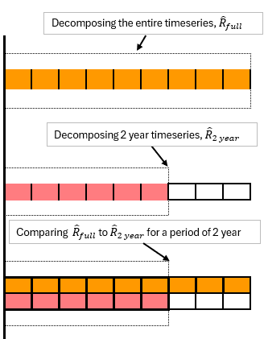
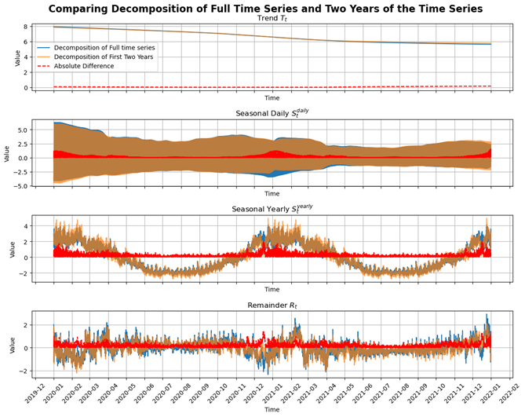

  
  

## 5.7 Real-time Forecasting

This section will investigate Real-time forecasting; the procedures for forecasting real time in the context of using energy. The focus will be on the difference between knowing the whole time series and real time forecasting prediction while looking at the difference in the remainders after a MSTL decomposition. Finally, a clear example with the time series from the rest of the thesis is produced.

To predict into the future with a dataset consisting of \\( Y_t \\) where \\( t = 1, 2, \ldots, T \\) represents the timesteps of recorded energy consumption up to \\( T \\) which is the current day. The objective is to forecast the energy consumption for a future period \\( Y_{T+h} \\) where \\( T = t+1, t+2, \ldots, t+h \\). Where \\( h \\) represents the forecasting horizon, which could be a day or a week, etc. The seasonal and trend components could be forecasted using statistical techniques which are well suited for extrapolation. SARIMA (Seasonal Auto Regressive Integrated Moving Average) could be used for the seasonal components and AR (Autoregressive model) for the trend component. The predicted components would then be \\( \hat{S}_{T+h}^{daily}, \hat{S}_{T+h}^{yearly}, \hat{T}_t \\) . These forecasted components are made from historical data of each respective component. To predict the remainders \\( R_t \\), the use of different methods could be employed; in this thesis, OLS and RF are being used. However, other methods such as boosting could be implemented. The remainders are represented as:

$$ \hat{R}_{T+h} = f(x_t, x_{t-1}, \ldots, x_{t-k}) $$

where \\( f \\) is the predictive model trained on the historical lagged values of \\( x \\). The final forecasting for the future energy consumption \\( \hat{Y}_{T+h} \\) is obtained by summing the predicted components:

$$ \hat{Y}_{T+h} = \hat{S}_{T1+h} + \hat{S}_{T2+h} + \ldots + \hat{T}_{T+h} + \hat{R}_{t+h} $$

To evaluate the model's performance, it will have to wait until \\( h \\) time has passed. The steps of comparing the estimated future energy consumption \\( \hat{Y}_{T+h} \\) can be directly compared to the true future energy consumption by using MAE, RMSE, and \\( R^2 \\).

To picture the idea of it in the real world, the same scenario was applied—in the case where there are only two years' time series and another where there is the whole time series. The two-year time series is apart from the whole time series. Both are then decomposed with the help of MSTL. Then the remainders (\\( \hat{R} \\)) are captured. The remainders for the first year, of the full-time series ( \\( \hat{R}_{full} \\)) are picked (\\( \hat{R}_{full2Year} \\) ) and compared to the remainders for the decomposed two years remainders (\\( \hat{R}_{2year} \\)). To help in understanding, the illustration can be seen in figure 33:

To look at the difference the following comparison has been made from the same time series as the rest of the thesis. The Full-time series, where the entire time series is decomposed, and one where 2 years of the time series is decomposed. They are then compared as illustrated above with the remainders for each decomposition. The following is the result of that comparison:

A segment of the two-year, decomposed via MSTL is observed. The trend component \\(T_t\\), when comparing the full time series to the initial two-year period, shows minimal absolute deviation, with a slight increase at the end of the series. This suggests a stable direction in the data with minor increase at the end. The daily seasonal component \\(S_t^{daily}\\) demonstrates greater variation, particularly accentuated during the year's end. This suggests a predictable, yet with fluctuation which could be linked to seasonal activities. When zooming out and looking at the yearly seasonality \\(S_t^{yearly}\\) a slight increase in the absolute and the differences are observed also around the year’s end, which support what \\(S_t^{daily}\\) demonstrated. However, it seems for trend and seasonal component the difference between a decomposition for the whole time series or for a two year decomposition are relative small. The Remainder component \\(R_t\\) show the largest differences. The absolute differences here underscore the challenge of predicting the decomposed time series. The disparities among the compared components, while present, are not significant. This indicates that real-time forecasts, although slightly less precise than the models utilizing the complete time series for decomposition, still maintain a reliable level of accuracy. Such models are capable of projecting future energy consumption. Therefore, it could be used in a real-world forecasting where the consumption is unknown.
