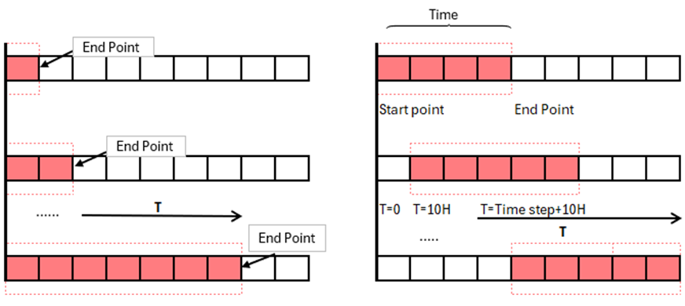

---
---

  
  

## 3.3 Theoretical framework for rolling windows

To address autocorrelation and improve the adaptability of forecasting models to new data trends, the rolling window approach is implemented as a forecasting method. This approach ensures a fixed starting point while extending the window's endpoint with each iteration through the dataset. By doing so, it allows for a systematic introduction of new data into the model, facilitating continuous adaptation and mitigating the effects of autocorrelation. The rolling window progresses by either moving a fixed-size window forward in time or by keeping the start point constant and only extending the endpoint, thereby incorporating additional data points with each move. This iterative re-estimation of forecasting models with the inclusion of newer data points up to the extended endpoint enhances the model's handling of time series dynamics and ensures that the most recent information is always considered in the forecasting process.

A specific variant of this technique focuses on maintaining a constant start point while only extending the window's end. This method proves particularly valuable when the objective is to assess the impact of integrating newer data on the forecasting model's performance from a consistent baseline. With each extension of the window, the model is exposed to a progressively longer dataset, potentially improving its predictive accuracy for future periods immediately following the newly included endpoint. Another rolling window approach, that will be used later in the thesis, is to keep the span of data constant while shifting the observation window forward in time. This is achieved by advancing the start and endpoint of the window equally with each timestep. This maintains the same data span; however, it also moves along the timeline. At each new position the window is in \\(T=0,  T=10m,  T=10h\\) and so on, the model recalibrates while using the last data batch within the window. By doing this systematic progression, it allows for the model to integrate and learn new information while retaining the same timeframe for analysis, thereby assessing the changes in patterns over time. To illustrate the two different types of rolling windows, the following illustration has been made:

It is important to consider which effects adjusting the window size has on forecasting accuracy. The window size essentially represents the scope of historical data that is considered relevant for future predictions. A smaller window size may allow the model to react swiftly to recent trends, enhancing its sensitivity to new developments. This is particularly beneficial in volatile markets where recent data may be more indicative of future outcomes. Conversely, a larger window size provides a more comprehensive view of long-term patterns, potentially reducing noise and leading to more stable forecast estimates.

When deciding on the window size, it is crucial to consider the trade-off between responsiveness and stability. A window that is too small may lead to overfitting, where the model excessively captures the noise as if it were a signal. This can result in unreliable predictions that follow the random fluctuations of the input data too closely. In contrast, a window that is too large may overlook recent shifts in data trends, thereby underfitting and failing to adapt to changes. It is also worth noting that the chosen window size can have implications for computational efficiency; larger windows require more data to be processed, which can increase computational time and resource usage.
