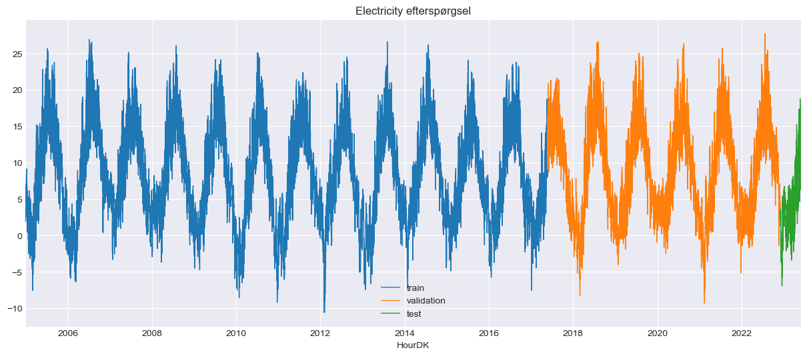
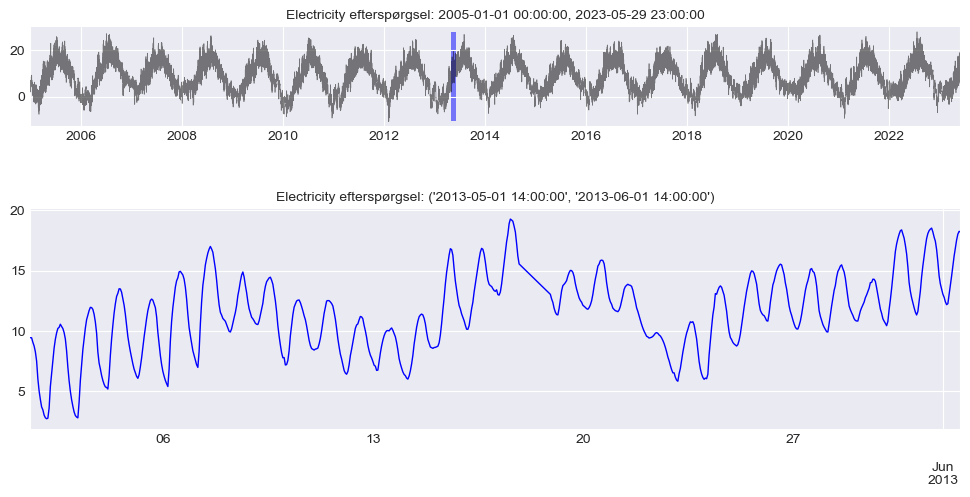
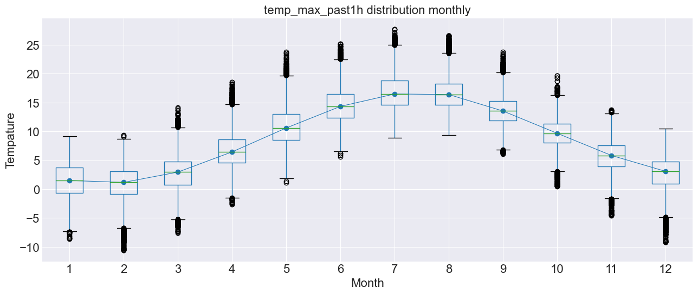
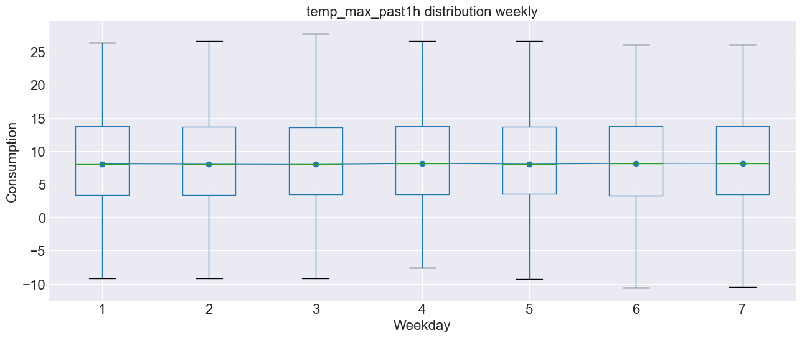
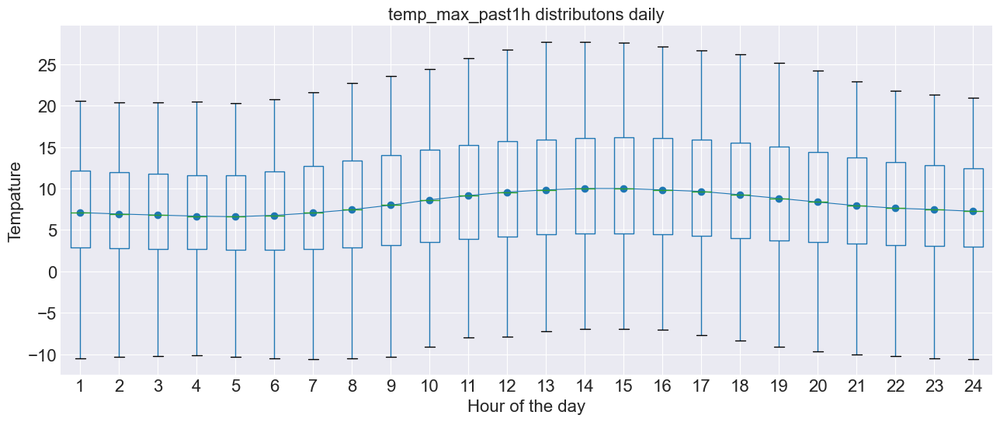

# Analyses of historical weather observations

This data has been collected via [DMI.dk](https://www.dmi.dk/frie-data/) by using their API, the data has been cleaned to only contain an average of all of Denmark. Lets take a look of the data:

```python
# loading of the data
Data = pd.read_csv("C:/Users/madsh/OneDrive/Dokumenter/kandidat/Fællesmappe/Speciale/Data/Forbrug og Vejr Data.csv")

# Choose only necessary columns and copy the dataframe
temp = Data[['HourDK', 'temp_max_past1h']].copy()

# Konvert 'HourDK' to datetime format og set it as the index
temp['HourDK'] = pd.to_datetime(temp['HourDK'])
temp.set_index('HourDK', inplace=True)

temp
```
<div>
<style scoped>
    .dataframe tbody tr th:only-of-type {
        vertical-align: middle;
    }

    .dataframe tbody tr th {
        vertical-align: top;
    }

    .dataframe thead th {
        text-align: right;
    }
</style>
<table border="1" class="dataframe">
  <thead>
    <tr style="text-align: right;">
      <th></th>
      <th>temp_max_past1h</th>
    </tr>
    <tr>
      <th>HourDK</th>
      <th></th>
    </tr>
  </thead>
  <tbody>
    <tr>
      <th>2005-01-01 00:00:00</th>
      <td>2.350000</td>
    </tr>
    <tr>
      <th>2005-01-01 01:00:00</th>
      <td>2.134545</td>
    </tr>
    <tr>
      <th>2005-01-01 02:00:00</th>
      <td>2.023636</td>
    </tr>
    <tr>
      <th>2005-01-01 03:00:00</th>
      <td>2.066667</td>
    </tr>
    <tr>
      <th>2005-01-01 04:00:00</th>
      <td>1.954545</td>
    </tr>
    <tr>
      <th>...</th>
      <td>...</td>
    </tr>
    <tr>
      <th>2023-05-30 17:00:00</th>
      <td>16.416364</td>
    </tr>
    <tr>
      <th>2023-05-30 18:00:00</th>
      <td>15.803704</td>
    </tr>
    <tr>
      <th>2023-05-30 19:00:00</th>
      <td>15.183333</td>
    </tr>
    <tr>
      <th>2023-05-30 20:00:00</th>
      <td>13.750000</td>
    </tr>
    <tr>
      <th>2023-05-30 21:00:00</th>
      <td>12.239286</td>
    </tr>
  </tbody>
</table>
<p>159767 rows × 1 columns</p>
</div>

As we can see in the code above, this is only one column of the dataset, Maximum temperature for the last hour, which is what we are interested at looking at in this project. in the table we can see that we have one observation for every hour.

```python
# fill in missing values
temp = temp.resample('H').asfreq()

# replace missing values with linear interpolation
temp.interpolate(method='linear', inplace=True)

temp=temp[:len(temp)-22]

temp
```
So that was a lie, we dont have an observation for EVERY hour, there is some missing data in the dataset, therefor we use linear interpolation to fill out the missing values.

<div>
<style scoped>
    .dataframe tbody tr th:only-of-type {
        vertical-align: middle;
    }

    .dataframe tbody tr th {
        vertical-align: top;
    }

    .dataframe thead th {
        text-align: right;
    }
</style>
<table border="1" class="dataframe">
  <thead>
    <tr style="text-align: right;">
      <th></th>
      <th>temp_max_past1h</th>
    </tr>
    <tr>
      <th>HourDK</th>
      <th></th>
    </tr>
  </thead>
  <tbody>
    <tr>
      <th>2005-01-01 00:00:00</th>
      <td>2.350000</td>
    </tr>
    <tr>
      <th>2005-01-01 01:00:00</th>
      <td>2.134545</td>
    </tr>
    <tr>
      <th>2005-01-01 02:00:00</th>
      <td>2.023636</td>
    </tr>
    <tr>
      <th>2005-01-01 03:00:00</th>
      <td>2.066667</td>
    </tr>
    <tr>
      <th>2005-01-01 04:00:00</th>
      <td>1.954545</td>
    </tr>
    <tr>
      <th>...</th>
      <td>...</td>
    </tr>
    <tr>
      <th>2023-05-29 19:00:00</th>
      <td>12.391071</td>
    </tr>
    <tr>
      <th>2023-05-29 20:00:00</th>
      <td>11.371698</td>
    </tr>
    <tr>
      <th>2023-05-29 21:00:00</th>
      <td>10.537736</td>
    </tr>
    <tr>
      <th>2023-05-29 22:00:00</th>
      <td>9.884906</td>
    </tr>
    <tr>
      <th>2023-05-29 23:00:00</th>
      <td>9.494340</td>
    </tr>
  </tbody>
</table>
<p>161352 rows × 1 columns</p>
</div>

The dataset starts on 2005-01-01 00:00:00 and ends on 2023-05-30 21:00:00. The last 22 observations are cut off so that the dataset starts on 2005-01-01 00:00:00 and ends on 2023-05-29 23:00:00. Lets plot data:

```python
# Time series plot
# ==============================================================================
fig, ax = plt.subplots(figsize=(15, 6))
data_train.temp_max_past1h.plot(ax=ax, label='train', linewidth=1)
data_val.temp_max_past1h.plot(ax=ax, label='validation', linewidth=1)
data_test.temp_max_past1h.plot(ax=ax, label='test', linewidth=1)
ax.set_title('Electricity efterspørgsel')
ax.legend();
```


Don't mind that the data has been split up into three sets; the picture has been reused from another project, which is why the plot's title is misleading as well. On the y-axis, we have the temperature, and on the x-axis, we have the time of the observation. Lets take a closer look of a arbitrary month.

```python
# Zooming time series chart
# ==============================================================================
zoom = ('2013-05-01 14:00:00','2013-06-01 14:00:00')
fig = plt.figure(figsize=(12, 6))
grid = plt.GridSpec(nrows=8, ncols=1, hspace=0.6, wspace=0)
main_ax = fig.add_subplot(grid[1:3, :])
zoom_ax = fig.add_subplot(grid[4:, :])
data.temp_max_past1h.plot(ax=main_ax, c='black', alpha=0.5, linewidth=0.5)
min_y = min(data.temp_max_past1h)
max_y = max(data.temp_max_past1h)
main_ax.fill_between(zoom, min_y, max_y, facecolor='blue', alpha=0.5, zorder=0)
main_ax.set_xlabel('')
data.loc[zoom[0]: zoom[1]].temp_max_past1h.plot(ax=zoom_ax, color='blue', linewidth=1)
main_ax.set_title(f'Electricity efterspørgsel: {data.index.min()}, {data.index.max()}', fontsize=10)
zoom_ax.set_title(f'Electricity efterspørgsel: {zoom}', fontsize=10)
zoom_ax.set_xlabel('')
plt.subplots_adjust(hspace=1)
```


As we can see, there is a clear daily seasonality and an upward trend. Let's take a closer look at the seasonality of the entire dataset to see if this pattern is significant.

## Yearly, weekly & daily seasonality
```python
# Boxplot for annual seasonality
# ==============================================================================
fig, ax = plt.subplots(figsize=(15, 6))
data['month'] = data.index.month
data.boxplot(column='temp_max_past1h', by='month', ax=ax,)
data.groupby('month')['temp_max_past1h'].median().plot(style='o-', linewidth=0.8, ax=ax, fontsize=16)
ax.set_ylabel('Tempature' ,fontsize=16)
ax.set_xlabel('Month', fontsize=16)
ax.set_title('temp_max_past1h distribution monthly', fontsize=16)
fig.suptitle('');
```    

As we can see, there is a clear yearly seasonality, as it gets colder in the winter and warmer in the summer, as one would expect.

```python
# Boxplot for weekly seasonality
# ==============================================================================
fig, ax = plt.subplots(figsize=(15, 6))
data['week_day'] = data.index.day_of_week + 1
data.boxplot(column='temp_max_past1h', by='week_day', ax=ax)
data.groupby('week_day')['temp_max_past1h'].median().plot(style='o-', linewidth=0.8, ax=ax, fontsize=16)
ax.set_ylabel('Tempature', fontsize=16)
ax.set_xlabel('Weekday', fontsize=16)
ax.set_title('temp_max_past1h distribution weekly', fontsize=16)
fig.suptitle('');
```  

as we can see there is not any weekly seasonality, as one would expect.

```python
# Boxplot for daily seasonality
# ==============================================================================
fig, ax = plt.subplots(figsize=(15, 6))
data['hour_day'] = data.index.hour + 1
data.boxplot(column='temp_max_past1h', by='hour_day', ax=ax)
data.groupby('hour_day')['temp_max_past1h'].median().plot(style='o-', linewidth=0.8, ax=ax,  fontsize=16)
ax.set_ylabel('Tempature', fontsize=16)
ax.set_xlabel('Hour of the day', fontsize=16)
ax.set_title('temp_max_past1h distributons daily', fontsize=16)
fig.suptitle('');
```    

as we can see their is a slight difference in the temperature doing the day, but probably not enough to be significant.
